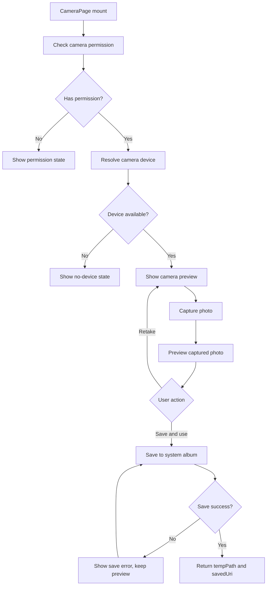

# RN 拍照页面 Design Spec

## 目标

在 React Native 示例应用中实现一个自定义拍照页面。页面需要支持相机预览、拍照、照片确认、保存到系统相册，并在保存成功后把结果返回给上层业务。

第一版明确采用“拍照 + 确认闭环”：

- 拍摄前展示相机预览和拍照入口。
- 拍摄后进入照片预览态。
- 用户可以重拍，或点击“保存并使用”。
- “保存并使用”必须先把照片写入系统相册。
- 保存失败时阻断完成，停留在预览态并允许重试。

## 范围

### In Scope

- 自定义 RN 拍照页面。
- 相机权限申请和无权限状态展示。
- 相机设备不可用状态展示。
- 拍照到临时文件。
- 拍照后照片预览。
- 重拍。
- 保存照片到系统相册。
- 保存失败阻断完成。
- 保存成功后返回 `{ tempPath, savedUri }`。
- Android/iOS 原生权限配置。
- 单测和原生构建验收。

### Out of Scope

- 视频录制。
- 相册选择已有图片。
- 图片裁剪、滤镜、美颜、压缩、水印。
- 上传远端服务。
- 自研 Android/iOS 相机桥。
- Expo Managed 支持。

## 推荐方案

采用 `react-native-vision-camera` + `@react-native-camera-roll/camera-roll`。

`react-native-vision-camera` 负责自定义相机预览和拍照。该库在 iOS 使用 AVFoundation，在 Android 使用 CameraX，并提供权限、设备选择、Camera View 和 Photo Output 能力。

`@react-native-camera-roll/camera-roll` 负责把拍到的临时文件保存到系统相册。这样相机能力和媒体库写入能力边界清晰，RN 页面只需要组合两类原生能力。

## 替代方案

### Expo Camera + MediaLibrary

适用于 Expo Managed 或 Expo Dev Client 项目。优点是 Expo 生态内权限和媒体库能力比较一体；缺点是 Bare RN 工程引入 Expo 模块体系会增加工程复杂度。

### 自研 Native 拍照保存桥

iOS 使用 AVFoundation + Photos，Android 使用 CameraX + MediaStore，再通过 RN NativeModule 或 TurboModule 暴露给 RN。优点是控制力最强；缺点是第一版成本过高，且当前需求可以由成熟 RN 包覆盖。

## 模块设计

### Native 接入层

职责：

- 安装相机依赖和相册依赖。
- iOS 写入 `NSCameraUsageDescription` 和相册写入权限描述。
- Android 写入 `android.permission.CAMERA`，并按目标 SDK 配置媒体库写入所需权限。
- 执行 CocoaPods 和 Gradle 构建验证。

验收：

- JS 可以 import 相机和相册模块。
- iOS Pods 安装成功。
- Android debug build 可以进入并通过构建。

### Camera Domain 层

职责：

- 封装 `useCameraPageController`。
- 统一权限状态、设备状态、拍照状态和保存状态。
- 提供页面事件：`requestCameraPermission`、`capturePhoto`、`retakePhoto`、`saveAndUsePhoto`、`switchCamera`。
- 输出页面状态：`checkingPermission`、`needCameraPermission`、`noDevice`、`ready`、`capturing`、`captured`、`saving`、`saveFailed`。

返回数据：

```ts
type SavedCameraPhoto = {
  tempPath: string;
  savedUri: string;
};
```

错误策略：

- 拍照失败：停留或回到可拍摄状态，展示错误并允许重试。
- 保存失败：停留在照片预览态，展示错误并允许再次保存。
- 权限拒绝：展示权限空态，不自动反复弹窗。

### Camera UI 层

组件拆分：

- `CameraPage`: 页面容器，组合状态机和子组件。
- `CameraPreview`: 渲染相机预览。
- `CameraControls`: 渲染拍照、切换摄像头、重拍、保存并使用。
- `CapturedPreview`: 渲染拍照后的图片预览。
- `CameraPermissionState`: 渲染权限、无设备、错误状态。

交互：

1. 首次进入页面，检查相机权限。
2. 未授权时展示授权按钮。
3. 授权成功后展示相机预览。
4. 点击拍照后进入 `capturing`，禁用重复点击。
5. 拍照成功后进入 `captured`，展示照片预览。
6. 点击重拍，清空临时照片并回到相机预览。
7. 点击保存并使用，进入 `saving`。
8. 保存成功后调用上层回调，返回 `{ tempPath, savedUri }`。
9. 保存失败后进入 `saveFailed`，保留预览图并允许重试。

## 数据流



## 权限策略

### iOS

- 相机权限：`NSCameraUsageDescription`。
- 相册写入权限：按 CameraRoll 版本要求配置 Photos 相关 usage description。
- 保存失败时必须提示用户，不允许静默返回临时文件。

### Android

- 相机权限：`android.permission.CAMERA`。
- 媒体写入权限：根据当前 target SDK 和 CameraRoll 文档配置。
- Android 10+ 优先依赖 MediaStore scoped storage 语义；不把第一版设计建立在外部存储绝对路径可写的假设上。

## 测试策略

### 单元测试

- Mock `react-native-vision-camera` 和 `@react-native-camera-roll/camera-roll`。
- 覆盖权限未授权、授权成功、无设备、拍照成功、拍照失败、保存成功、保存失败。
- 验证保存失败不会调用完成回调。
- 验证保存成功返回 `{ tempPath, savedUri }`。

### 构建测试

- `pnpm --filter hybrid-agent-demo test -- --watchman=false`
- `cd example/android && ANDROID_HOME=${ANDROID_HOME:-/Users/bytedance/Library/Android/sdk} GRADLE_USER_HOME=/tmp/gradle-home ./gradlew assembleDebug`
- `cd example/ios && PATH=/opt/homebrew/opt/ruby/bin:$PATH bundle exec pod install`
- `pnpm --filter hybrid-agent-demo ios:build`

### 手工验收

- 首次进入页面能看到相机权限请求。
- 授权后能看到相机预览。
- 点击拍照后能进入照片预览态。
- 点击重拍能回到预览态。
- 点击保存并使用后，照片出现在系统相册。
- 模拟保存失败时，页面阻断完成并允许重试。

## 风险

- VisionCamera 版本可能与当前 RN 版本不兼容，实施前必须确认当前 `example` 的 RN 版本和包 peer dependencies。
- CameraRoll 在 Android 不同 target SDK 下的权限要求可能不同，实施时必须按当前项目 SDK 验证。
- iOS 模拟器不适合完整相机验收，最终拍照能力需要真机验证。
- 保存到系统相册涉及用户隐私权限，失败提示必须清晰，不应把临时文件误当作已保存成功。

## 验收标准

- 页面完成“预览 -> 拍照 -> 预览确认 -> 保存相册 -> 返回结果”的闭环。
- 保存失败时不会返回成功结果。
- 代码按功能拆分为 Domain 和 UI 组件。
- Android/iOS 原生权限配置完整。
- 单测覆盖主要状态分支。
- 原生构建通过，或明确记录环境阻塞。
- 文档系统包含该拍照页面的使用说明和验证记录。

## Self Review

- Placeholder scan: 无 TBD、TODO 或未定字段。
- Internal consistency: 方案、数据流、错误策略和验收标准一致。
- Scope check: 第一版聚焦拍照保存闭环，不包含上传、裁剪、视频录制等扩展。
- Ambiguity check: 保存失败策略明确为阻断完成并允许重试。
